# Node.js 调试

## [debugger](https://nodejs.org/api/debugger.html)

此方法感觉十分难用且不方便 , 暂时放弃了

---

## [inspector](inspector_chinese.md)

此方式简单易用 , 就好像chrome调试js那样 , 就选它了

这是利用 `--inspect` 在激活调试器并打印连接URL , 有以下两种方式 , 若想知道详细的命令行请查看[inspector](inspector_chinese.md)

### 1. Chrome DevTools

* 运行js时 , 在 `node` 命令和文件名之间加上 `--inspect` 选项

    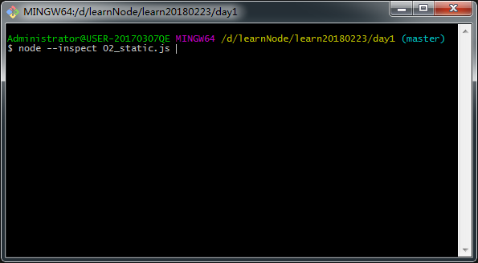

* 在chrome浏览器打开 `chrome://inspect` (本人使用版本为 64.0.3282.140（正式版本）)

    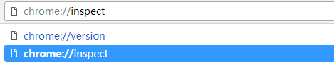

* 点击 `open dedicated DevTools for Node` 链接或者 `Target` 里面对应运行的js文件的 `inspect` 链接

    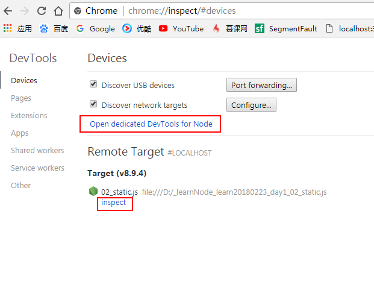

* 然后就进入了 `DevTools` , 现在就可以开始测试 , 就像在浏览器测试前端js那样

    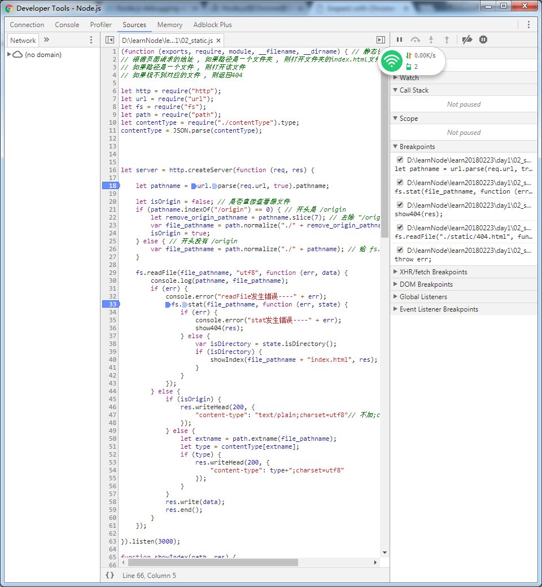

* 甚至 `console` 内容都可以在调试的时候看到

    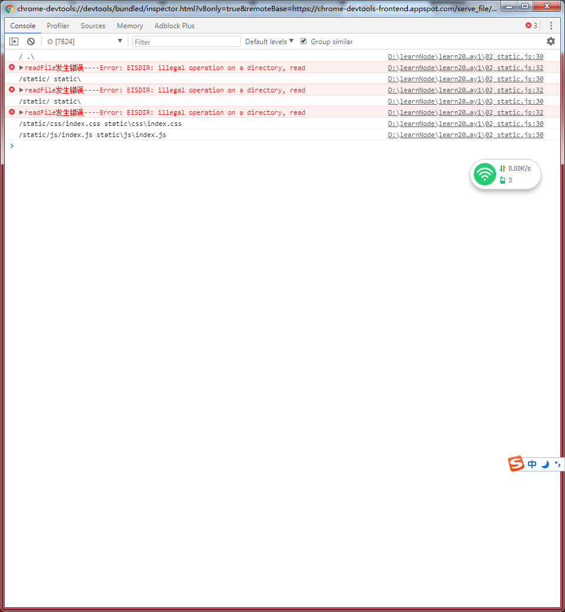

上面的例子是一个静态服务器 , 实际你会发现 , 只要 `http.createServer` 回调函数里面代码设置断点才有效。

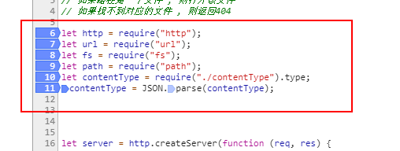;

那是因为 , 这些代码不是异步执行 , 在用 `node` 命令运行的时候就开始执行 , 在我们打开浏览器之前(就是调试前)就已经执行完了 , `http.createServer` 回调函数里面的代码是异步的 , 是因为我们打开浏览器输入对应的网址 `localhost:3000` 使用这个静态服务器触发的 . 

下面是一个全部都是同步执行代码

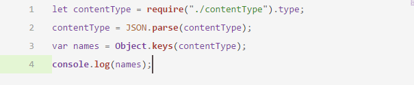;

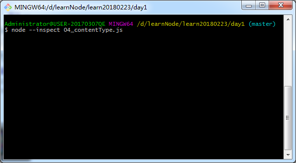;

执行后 , 终端没有挂起 , 执行完 , console结果全部在终端中输出 ; `Chrome DevTools` 什么都没得调试 , 其实原因也是一样 , `Chrome DevTools` 还没有反应过来 , 代码就执行完了.

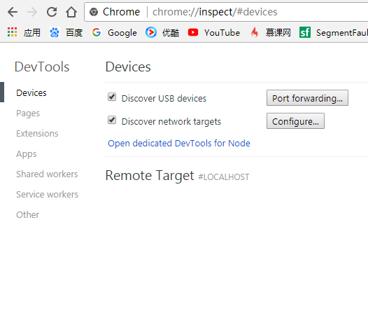;

我们要理清思路 , 我们的js代码是由 `node.exe` 执行的 , 不同于前端页面的js是由chrome直接执行 , 所以前端页面的js只要设置断点都有效 . 

再看看我们调试nodejs的步骤:

1. 先在终端执行js代码 ,  

2. 然后点击 `open dedicated DevTools for Node` 链接进入调试(在打开`DevTools for Node`之前 , 就算之前已经设置了断点 , 也是不会停的 ; 就好像前端js调试 , 打开`开发者工具`之前 , 就算之前设置了断点 , 也是不会停下) .

对于同步执行代码来说 , 在你点击 `open dedicated DevTools for Node` 之前就执行完了.

#### 调试前端js的步骤 vs 调试nodejs步骤

1. 输入网址 , 页面加载的过程 , 其实js就开始执行 (node---nodejs执行js)

2. `F12` 打开开发者工具(控制台) , 调试js (node---`open dedicated DevTools for Node`调试就是)

3. 其实前端js的同步执行的已经执行 , 设置断点也没有用了 , 我们可以设置的有效断点 , 就是一些异步操作(比如事件里面的回调函数 ; 一些在某些条件下触发异步事件啊 , 比如点击某个按钮后触发的请求) (node---也是只能调试一些异步操作的代码)

    归根到底 , 就是只能调试一下 , 打开控制台后才执行的代码

4. 前端js表示 , 对于同步执行的代码 , 我们可以先设置断点 , 然后**刷新** , 是吧 , 记得吗 , 我们要调试前端js的同步代码都是要打开控制台 , 设置断点 , 刷新 . (node---我不可以刷新啊)

5. 前端js再表示 , 我可以先打开控制台 , 由于以前设置过一些断点 , 再输入网址 , 同步代码的断点也是有效的 (node---我运行代码前 , 不可以打开对应的调试啊)

学前端刷新 , node的刷新(`ctrl+c`后再执行) , 但是在`ctrl+c`的时候 , 对应的调试就会消失 , 再执行 , 不就相当于从头开始 ; 

学前端先打开控制台 , 也不行啊 , 要node执行后 , 才出现对应的调试啊 , 要点进对应的调试 , 断点才有效 , 但是这个过程 , 同步执行的代码早就执行完了

不能像前端调试js那样是因为node调试是要先运行 , `open dedicated DevTools for Node` 才会出现对应的调试 . 

#### 调试 nodejs 同步执行的代码

其实看了 [inspector](inspector_chinese.md) 就会知道 , 别人就提供了对应的办法

`--inspect-brk` 在用户代码开始之前中断 , 就是一开始就中断执行代码 , 这样就有让我们打开调试的时间了

* 运行js

    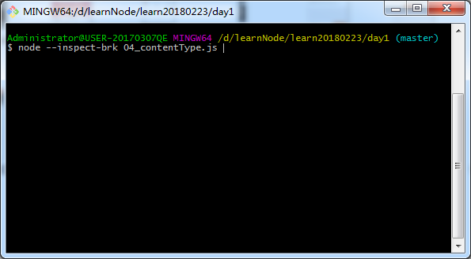

* 会发现 , `open dedicated DevTools for Node` 里面出现对应的调试了

    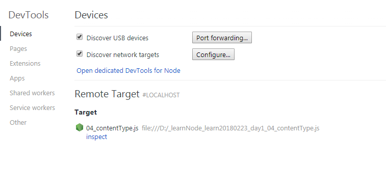

* 进入调试 , 代码在最开始的地方就中断了

    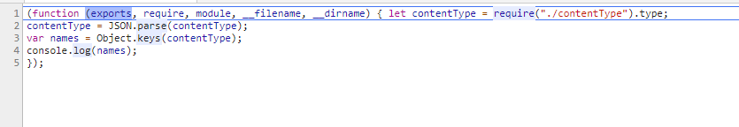
    
    

    

