# Node.js 调试

## 一、[debugger](https://nodejs.org/api/debugger.html)

此方法感觉十分难用且不方便 , 暂时放弃了

---

## 二、[inspector](inspector_chinese.md)

[英文原版网址](https://nodejs.org/en/docs/inspector/)

此方式简单易用 , 就好像chrome调试js那样 , 就选它了

这是利用 `--inspect` 在激活调试器并打印连接URL , 有以下两种方式 , 若想知道详细的命令行请查看[inspector](inspector_chinese.md)

### 1. Chrome DevTools

* 运行js时 , 在 `node` 命令和文件名之间加上 `--inspect` 选项

    

* 在chrome浏览器打开 `chrome://inspect` (本人使用版本为 64.0.3282.140（正式版本）)

    

* 点击 `open dedicated DevTools for Node` 链接或者 `Target` 里面对应运行的js文件的 `inspect` 链接

    

* 然后就进入了 `DevTools` , 现在就可以开始测试 , 就像在浏览器测试前端js那样

    

* 甚至 `console` 内容都可以在调试的时候看到

    

上面的例子是一个静态服务器 , 实际你会发现 , 只要 `http.createServer` 回调函数里面代码设置断点才有效。

;

那是因为 , 这些代码不是异步执行 , 在用 `node` 命令运行的时候就开始执行 , 在我们打开浏览器之前(就是调试前)就已经执行完了 , `http.createServer` 回调函数里面的代码是异步的 , 是因为我们打开浏览器输入对应的网址 `localhost:3000` 使用这个静态服务器触发的 . 

下面是一个全部都是同步执行代码

;

;

执行后 , 终端没有挂起 , 执行完 , console结果全部在终端中输出 ; `Chrome DevTools` 什么都没得调试 , 其实原因也是一样 , `Chrome DevTools` 还没有反应过来 , 代码就执行完了.

;

我们要理清思路 , 我们的js代码是由 `node.exe` 执行的 , 不同于前端页面的js是由chrome直接执行 , 所以前端页面的js只要设置断点都有效 . 

再看看我们调试nodejs的步骤:

1. 先在终端执行js代码 ,  

2. 然后点击 `open dedicated DevTools for Node` 链接进入调试(在打开`DevTools for Node`之前 , 就算之前已经设置了断点 , 也是不会停的 ; 就好像前端js调试 , 打开`开发者工具`之前 , 就算之前设置了断点 , 也是不会停下) .

对于同步执行代码来说 , 在你点击 `open dedicated DevTools for Node` 之前就执行完了.

#### 调试前端js的步骤 vs 调试nodejs步骤

1. 输入网址 , 页面加载的过程 , 其实js就开始执行 (node---nodejs执行js)

2. `F12` 打开开发者工具(控制台) , 调试js (node---`open dedicated DevTools for Node`调试就是)

3. 其实前端js的同步执行的已经执行 , 设置断点也没有用了 , 我们可以设置的有效断点 , 就是一些异步操作(比如事件里面的回调函数 ; 一些在某些条件下触发异步事件啊 , 比如点击某个按钮后触发的请求) (node---也是只能调试一些异步操作的代码)

    归根到底 , 就是只能调试一下 , 打开控制台后才执行的代码

4. 前端js表示 , 对于同步执行的代码 , 我们可以先设置断点 , 然后**刷新** , 是吧 , 记得吗 , 我们要调试前端js的同步代码都是要打开控制台 , 设置断点 , 刷新 . (node---我不可以刷新啊)

5. 前端js再表示 , 我可以先打开控制台 , 由于以前设置过一些断点 , 再输入网址 , 同步代码的断点也是有效的 (node---我运行代码前 , 不可以打开对应的调试啊)

学前端刷新 , node的刷新(`ctrl+c`后再执行) , 但是在`ctrl+c`的时候 , 对应的调试就会消失 , 再执行 , 不就相当于从头开始 ; 

学前端先打开控制台 , 也不行啊 , 要node执行后 , 才出现对应的调试啊 , 要点进对应的调试 , 断点才有效 , 但是这个过程 , 同步执行的代码早就执行完了

不能像前端调试js那样是因为node调试是要先运行 , `open dedicated DevTools for Node` 才会出现对应的调试 . 

#### 调试 nodejs 同步执行的代码

其实看了 [inspector](inspector_chinese.md) 就会知道 , 别人就提供了对应的办法

`--inspect-brk` 在用户代码开始之前中断 , 就是一开始就中断执行代码 , 这样就有让我们打开调试的时间了

* 运行js

    

* 会发现 , `open dedicated DevTools for Node` 里面出现对应的调试了

    

* 进入调试 , 代码在最开始的地方就中断了

    

经发现 , 其实浏览器开发者工具(`F12`) , 就有快捷进入node调试的入口 ; 前提是在 `DevTools` 已经添加了监听 `--inspect` 的主机端口 , 否则是没有那个快捷入口按钮的

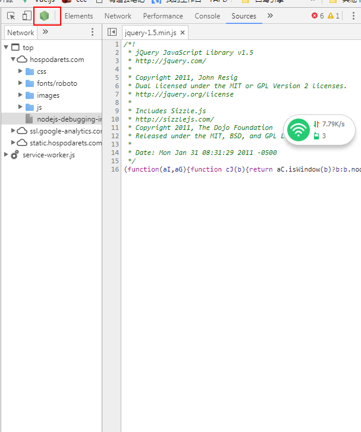

添加监听 `--inspect` 的主机端口

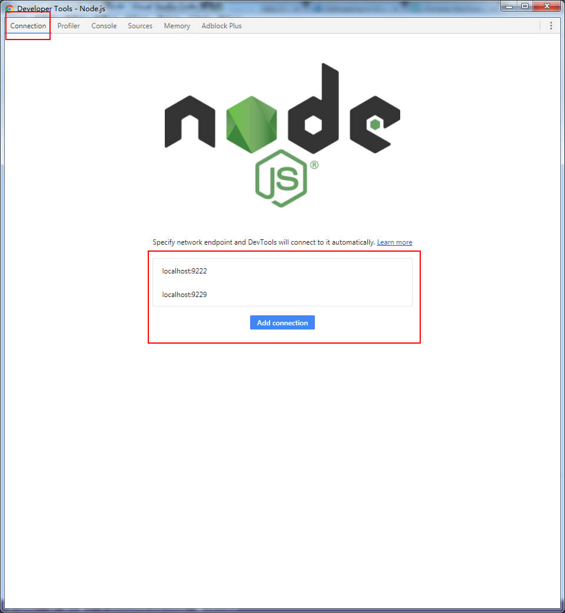

而且 , 原来进入调试的时候 , 终端有输出的 , 这也再一次证明 , node是先运行才可以进行调试的

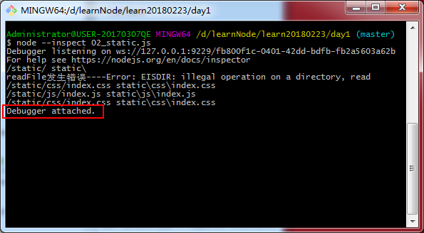

#### `--inspect` 命令选项的使用

`--inspect`： 不会再第一行断掉（适合web程序或者有监听的程序调试）

`--inspect-brk` ：是在第一行断点（适合函数类、工具类调试）

还有有其他命令

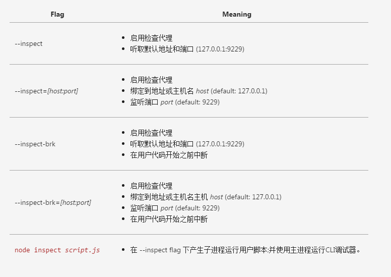

除了默认主机端口还可以自己设置地址和端口

其中斜体 `[host:port]` 是用 `[]` 括住 , 代表是可以忽略的

demo

``` bash
    # node 版本 v8.9.4
    node --inspect 02_static.js
    node --inspect= 02_static.js
    node --inspect=127.0.0.1 02_static.js
    node --inspect=5000 02_static.js
    node --inspect=127.0.0.1:5000 02_static.js
```

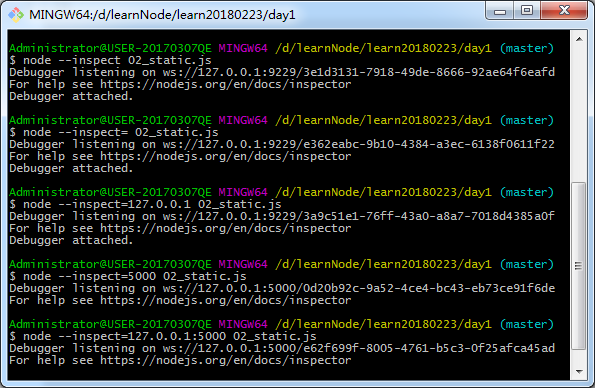

无论是`host` , `port` 都会忽略 , 还是只忽略任意一个 , 还是全写都可以 ; 而且终端会输出 , `--inspect` 监听的主机地址

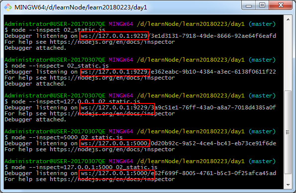


### 2. NIM(Node.js 调试管理工具)

安装Chrome扩展程序 NIM(Node.js 调试管理工具) https://chrome.google.com/webstore/detail/nim-node-inspector-manage/gnhhdgbaldcilmgcpfddgdbkhjohddkj (需要翻墙)

插件会自动监听`localhost:9229`端口 , 当监听到有调试代码执行的时候，会自动弹出调试框

即一般用node运行js添加`--inspect`或者`--inspect-brk`时就会自动弹出

上面的一个例子也表明默认只是监听`:9229`

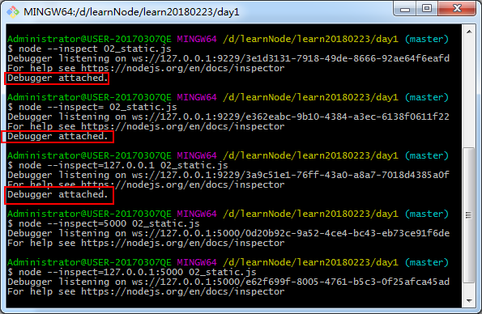

只有 `127.0.0.1:9229` 才会自动弹出( `127.0.0.1` 即本地地址 `localhost`) , 其实插件也是可以设置监听的端口号的(好像也要在翻墙的时候才可以设置)

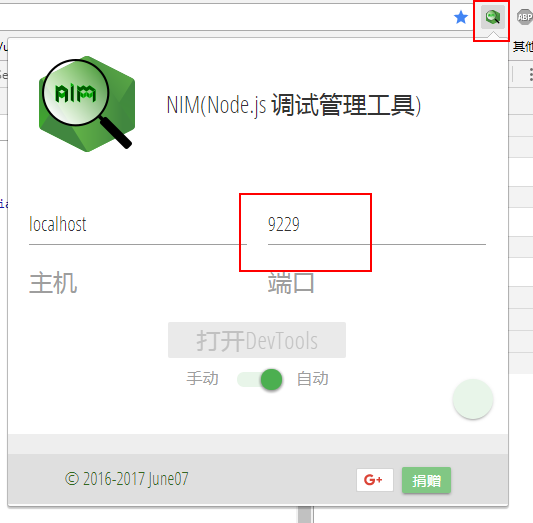

---

## 三、vscode 

### 1. 配置 `launch.json`

在“调试”面板中，单击设置图标来打开 `.vscode/launch.json`.选择“Node.js”进行初始设置。[设置文档](https://code.visualstudio.com/docs/editor/debugging#_launch-configurations)


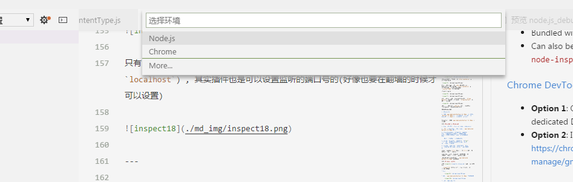

初始设置后 , vscode 会自动新建一个调试配置文件 `launch.json` , 并将放进 `.vscode` 文件夹里

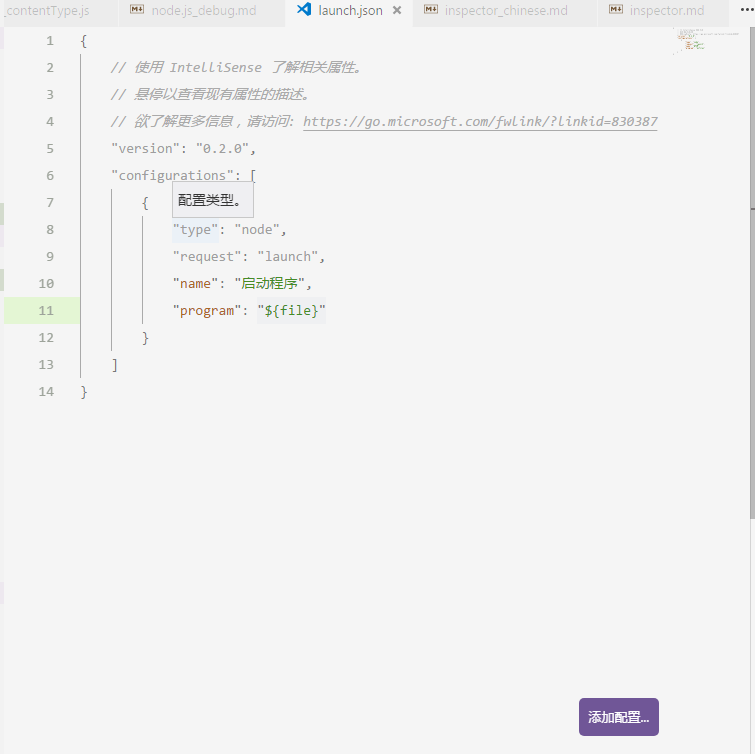

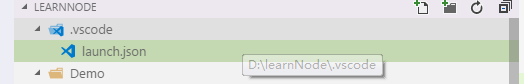

配置文件是一个json格式 , 其中灰色部分是选择“Node.js”进行初始设置时 , vscode自动配好 , 只要把鼠标光标指向属性名 , 就会出现这个属性的解释

1. 启动配置文件必须选项

    * `type` - 配置类型 , 启动配置的调试器类型: `node`、`chrome`、`php`、`go`……
    * `request` - 此启动配置的请求类型。目前支持的是`launch`(启动)和`attach`(附加)。
    * `name` - 出现在Debug启动配置下拉列表中的名称
        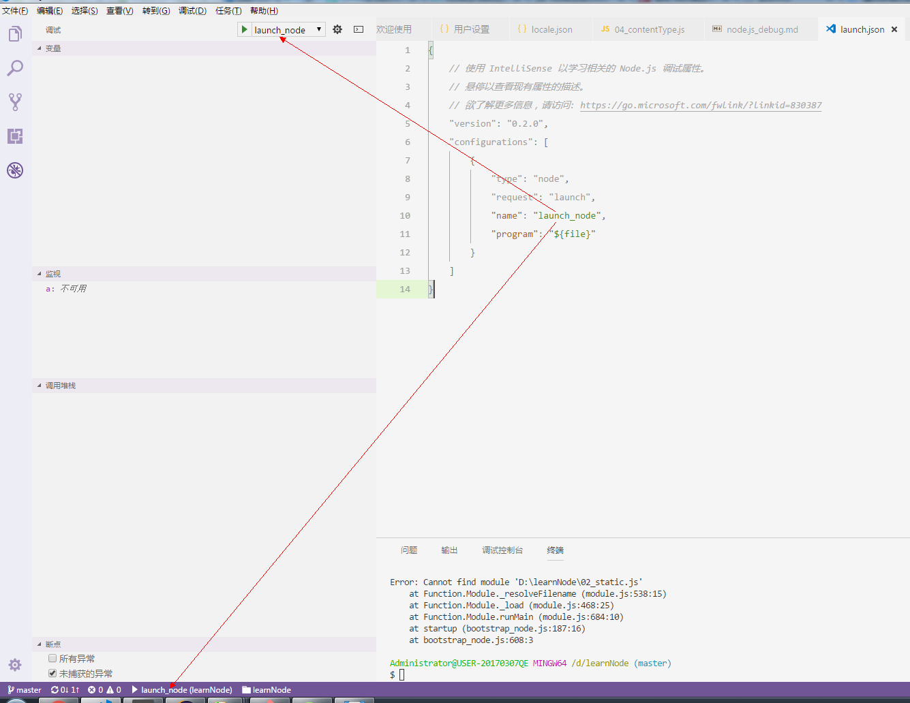

2. 许多调试器支持以下一些属性
    * `program` - 启动调试器时运行的可执行文件或文件

配置文件支持以下预定义变量：

* `${workspaceFolder}` - 在VS Code中打开的文件夹路径
* `${workspaceFolderBasename}` - VS代码中打开的文件夹的名称，不带任何斜杠（/）
* `${file}` - 当前打开的文件
* `${relativeFile}` - 当前打开的文件相对于workspaceFolder
* `${fileBasename}` - 当前打开的文件的基本名称
* `${fileBasenameNoExtension}` - 当前打开的文件的基本名称，没有文件扩展名
* `${fileDirname}` - 当前打开的文件的dirname
* `${fileExtname}` - 当前打开的文件的扩展名
* `${cwd}` - 启动时任务运行者的当前工作目录
* `${lineNumber}` - 活动文件中当前选定的行号

其实基本不用管这个配置文件 , 只要调试前有就可以 , 基本就是进行初始设置后就可以用了 , 并且需要新配的时候可以点击 "添加配置.." 来帮助配置

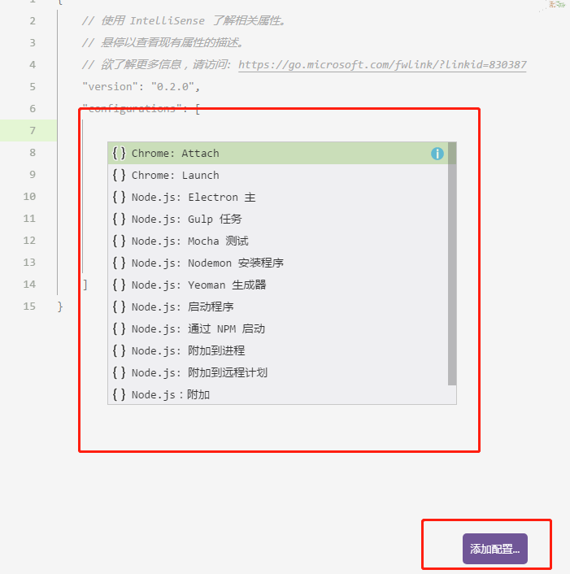

### 2. 调试

其实调试好简单 , vscode的编辑界面就相当于chrome的开发者工具 , 可以直接设置断点

* 打开需要调试的文件() , 设置断点

    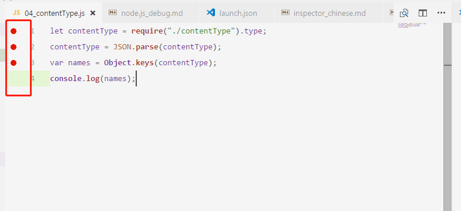

* 按 `F5` 开始调试 , 或者在“调试”面板中点击开始调试按钮
    
    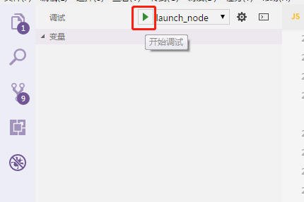

* 调试就开始了

    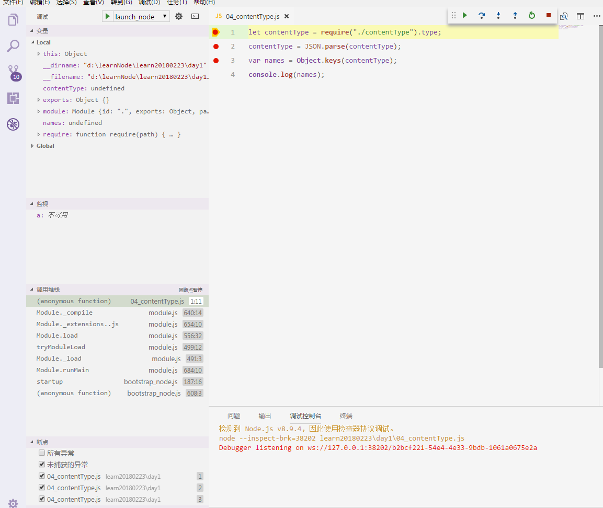

* 通过点击按钮来逐步调试

    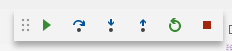

    和chrome的一样

    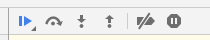

    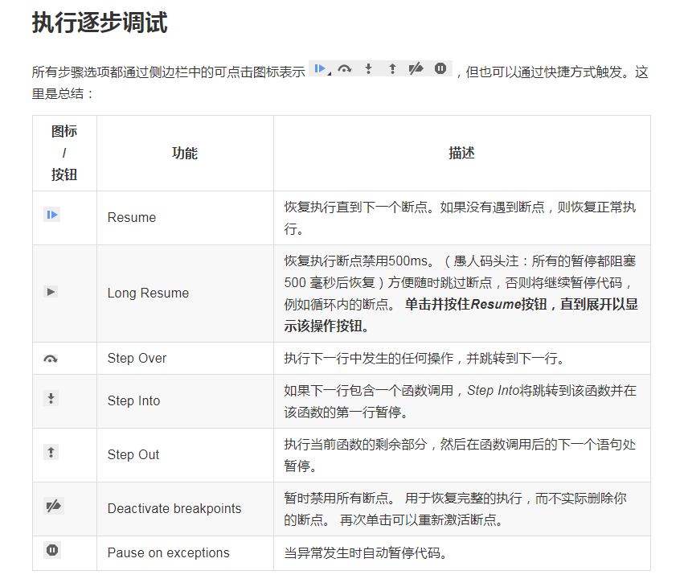


其实vscode的调试界面和chrome的是几乎一样的

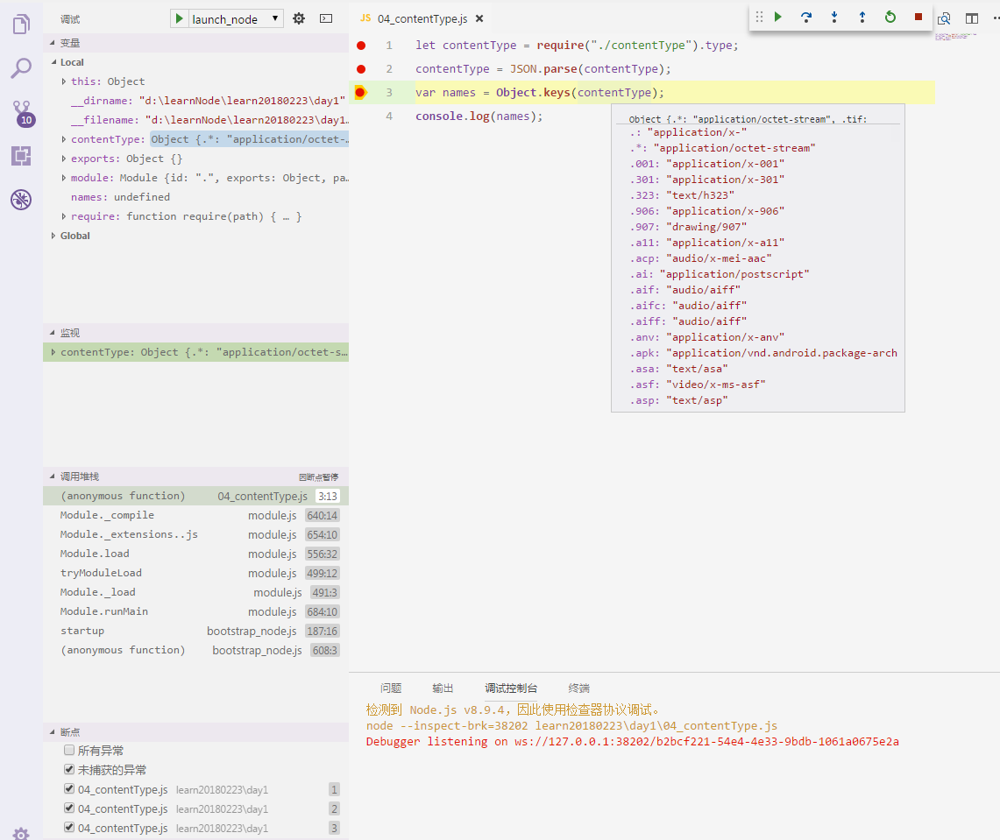

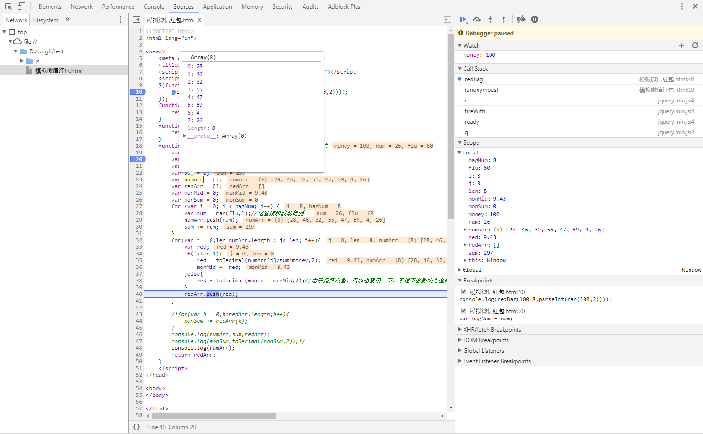

在代码编辑区 , 鼠标放在执行过的代码的变量上 , 出现变量的值

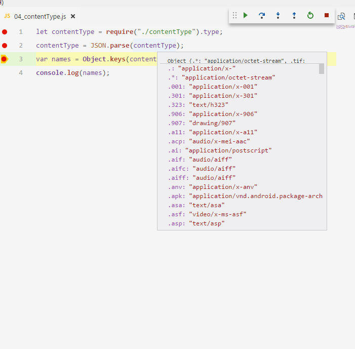

编辑器的左边 , 相当于chrome开发者工具的Sources面板

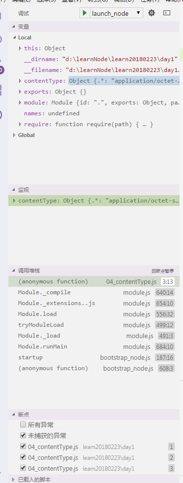

* `变量` 相当于 `Scope`
    出现代码运行中涉及的变量 , 其中`Local`是局部作用域(js中函数作用域)包含的变量 , `Global` 是全局作用域中包含的变量
* `监视` 相当于 `Watch`
    用于添加需要监视的变量 , 变量值会随着应用程序的运行而改变
* `调用堆栈` 相当于 `Call stack`
    表示代码现在执行到哪里，它是如何到达这里的，接着调用什么函数 ， 是调试的一个重要因素。特别是有异步操作的时候 ， 对于理解代码的运行十分有用

你会发现 , vscode是可以直接调试同步执行的代码的 , 就好像上面所说的相当于浏览器先打开开发者工具 , 在打开页面那样 。但是实际上vscode也是采用 `--inspect-brk` 命令进行调试的 , 看"调试控制台"   

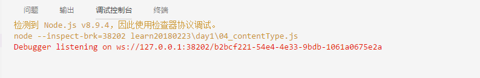    
    

    


